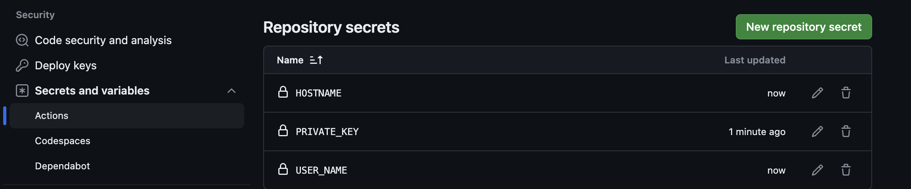
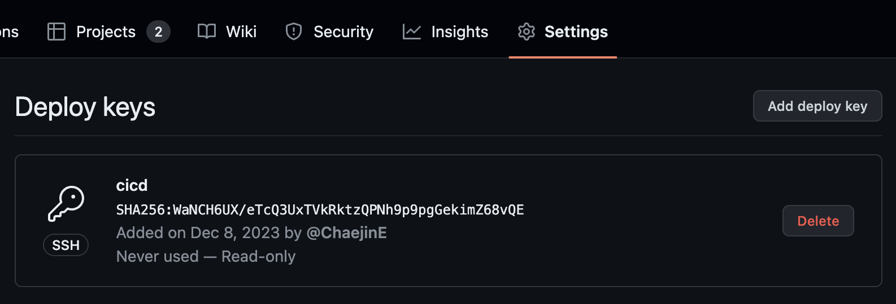

# Frontend
```
cd github-action
```
- Join in the github-action folder

## How to create app

```bash
npx create-react-app hello-frontend
``` 
 
## Docker
### First Develop

```bash
IMG=my-app
TAG=dev
docker build -f Dockerfile.frontend.dev -t ${IMG}:${TAG} .
```
- docker build

```bash
IMG=my-app
TAG=dev
LOCAL_PATH=$PWD/hello-frontend
CONTAINER_PATH=/usr/src/app
LOCAL_PORT=2000
CONTAINER_PORT=3000
docker run --rm -it -d -v ${LOCAL_PATH}:${CONTAINER_PATH} -p ${LOCAL_PORT}:${CONTAINER_PORT} ${IMG}:${TAG}
```
- docker image run

### Ready to Production
- reference ```Dockerfile.frontend.production```
- If you wanna build or run app on production environment, you can apply develop stage process too

## Repository Setup For CICD

- add secrets for deploy
  - You can get private key using this code ```cat ~/.ssh/id_rsa``` on your local computer
  - If you dont have above private key, generate using this code    ```ssh-keygen``` or search on web
  - You might get id_rsa.pub(publick key), id_rsa(private key)

## Server Setup For CICD
```bash
PUBLIC_KEY=<Your id_rsa.pub file content>
echo ${PUBLIC_KEY} >> ~/.ssh/authorized_keys
```
- You should add your local public key on deploy server
- Or alternatively, use ```vim``` command and copy public key to authorized_keys file



```bash
ssh-keygen
```
- generate ssh key on the server

```bash
cat ~/.ssh/id_rsa.pub
```
- Through above command, you can get public key for cloning repository
- And Enroll in your repository this public key
- Dont hesitate with your local public key

```bash
cd ~
git clone git@github.com:ChaejinE/Toy-Project.git
```

```bash
sudo apt-get update
sudo apt-get install build-essential
sudo apt-get install curl
curl -sL https://deb.nodesource.com/setup_18.x | sudo -E bash -- 
sudo apt-get install nodejs
```
- install nodejs:18

```bash
cd Toy-Project/cicd-demo-app/hello-frontend
npm install && npm run
```
- deploy your app 

## Deploy using my-app-cicd.yaml
- After removing button tag's annotation on src/App.js, Push code on Repository

```bash
git push origin main
```
- Whenever changed code, push to repository using above command